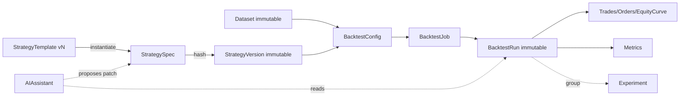

# AlphaLab — Architecture

> Status: approved for implementation (v2 — adversarial review 2026-09-09 incorporated; see `docs/architecture-review.md` for the audit trail).
> This document is the system-level source of truth. On conflict with `docs/` specs, this document wins unless an ADR explicitly overrides it.

## 1. What AlphaLab is

AlphaLab is a **deterministic trading-research system with an AI assistant on top** — not an AI wrapper around a backtester.

Core loop: **Idea → Structured strategy → One-click backtest → Inspect → Modify → Compare.**

The deterministic core (strategy validation, market data, backtest execution, accounting, metrics) must work fully with **no AI, no network, no paid services**. AI only proposes structured changes, explains, and summarizes; it never computes money.

## 2. System shape (decision)

**Modular monolith, polyglot: one Python process + static SPA, SQLite, in-process jobs.** See `docs/adr/0001-system-shape.md` and `0009-tech-stack.md`.

```text
web/  (TypeScript React + Vite — research UI only, no financial authority)
    │  REST + SSE (localhost:4100)
backend/alphalab_api  (Python FastAPI — auth stub, validation, orchestration, jobs)
    ├── alphalab_core   (PURE Python: strategy, indicators/numpy kernels, engine, metrics — stdlib+numpy only)
    ├── alphalab_marketdata (CSV import, normalize, validate, version; synthetic generator)
    ├── alphalab_store  (SQLAlchemy 2 + SQLite, Alembic migrations, content hashing)
    ├── alphalab_ai     (AIAssistant port: Gemini free-tier primary + rule-based fallback)
    └── shared/schemas/ (canonical JSON Schema + OpenAPI — both sides codegen from this)
```

```
repo/
  backend/               # Python: alphalab_core (pure) | alphalab_contracts (schema validation/hashing) | alphalab_api | alphalab_ai | alphalab_store | tests/
  web/                   # TypeScript React+Vite app (Zod schemas generated from shared/schemas)
  shared/schemas/        # strategy.spec.json + openapi.yaml — THE cross-language contract
  docs/adr/
  data/samples/
```

**Module dependency rules (CI-enforced, not conventional):** `alphalab_core` imports stdlib + numpy only (purity test fails on `fastapi/sqlalchemy/httpx/generativeai` imports). `web/` never computes money (grep-gate on engine/math keywords outside `formatters/`). Contract-equivalence test: every strategy fixture valid in Pydantic must validate in Zod and vice versa.

No microservices, no Redis/Kafka/K8s, no broker connectors, no separate Node backend service in MVP.

## 3. Tech stack (decision)

| Concern | Choice | Why |
|---|---|---|
| Backend / core | Python 3.12, FastAPI, Pydantic v2, SQLAlchemy 2 + SQLite (`aiosqlite`), Alembic | Quant ecosystem (numpy, pytest, hypothesis), strong server validation, AI SDK maturity; single API process keeps audit linear |
| Core purity | `alphalab_core`: stdlib + numpy only | Purity test blocks I/O/AI/SQL imports; numpy confined to causal indicator kernels, event loop stays explicit-index (no vectorized signal shifts) |
| Frontend | TypeScript React 18 + Vite + TanStack Query + uPlot/ECharts; Zod schemas codegen'd from `shared/schemas` | SPA fits localhost dashboard; Next.js deferred (no SEO/SSR need — see ADR 0009); Node confined to toolchain + form validation mirror |
| Contract bridge | Canonical `strategy.spec.json`; `make codegen` emits web enums (CI freshness-gated); backend validates jsonschema-direct against the same file; template fixtures re-validate in CI | Prevents the polyglot killer (schema drift) by making drift a red build |
| Tests | pytest + hypothesis (backend, incl. property tests) + Vitest (web) | Best-in-class deterministic + property testing per side |
| Jobs | asyncio in-process queue (no Redis/Celery in MVP) | Same semantics as before, Python-native |
| Time | UTC millis integers everywhere; ISO-8601 only at API boundary | Eliminates tz bugs |
| Money | `Decimal` for cash/fees/notional accounting; floats confined to indicator kernels with documented epsilon + exact-cent fixtures | Avoids 0.1+0.2 drift where it matters |

Full rationale, including why Vite beats Next.js for this MVP and where Node.js does/doesn't belong: `docs/adr/0009-tech-stack.md`; persistence: `0006-persistence.md`.

## 4. Domain map and boundaries

| Domain | Owns | Must not own |
|---|---|---|
| Strategy | `StrategySpec` schema, validation, versioning, templates | Execution, market data, money math |
| Market data | Canonical `Bar`, dataset import/normalize/validate/version | Strategy logic, P&L |
| Execution (engine) | Event ordering, signals→orders→fills, positions, equity | AI, HTTP, SQL |
| Accounting/Metrics | Trades, equity curve, drawdown, all performance numbers | Data fetching, UI formatting |
| Research | BacktestRun identity, experiment groups, comparison diff | Metric definitions |
| AI | Proposal/explanation/summary via `AIAssistant` port | Any authoritative number |
| App/Jobs | REST, validation, job lifecycle, orchestration | Financial math |

Entity overview (full model: `docs/domain-model.md`):



**Key invariants (non-negotiable):**
1. `core` is pure and synchronous: `(spec, bars, config) → run`. No wall-clock, no unseeded random, no I/O. Event loop explicit-index; no vectorized signal shifts.
2. Completed `StrategyVersion`, `Dataset`, `BacktestRun` are **immutable**. Edits create new versions; history is never mutated.
3. Frontend numbers are **never authoritative** — always rendered from `BacktestRun.metrics` computed in `core`.
4. AI output is **always untrusted input**: schema-validate → grounding-check → user confirm → atomic `apply_patch` → new version → deterministic rerun.
5. One authoritative calculation path per metric (defined in `docs/results-experiments.md`; versioned under `engineVersion`).
6. Same `(specHash, datasetHash, configHash, engineVersion, instrumentMetaVersion)` → identical `resultHash`. Indicators seed from the warmup lookback, never from `startTime` directly.

## 5. How a backtest executes (summary)

Full semantics: `docs/backtest-engine.md`. The one-paragraph contract:

> Bars iterate strictly in ascending `openTime`. Indicators at bar `t` use only bars `≤ t`. Signals are evaluated on **closed** bar `t` and filled no earlier than **open of bar `t+1`** (plus spread/slippage/commission). Open stops/targets attached to a position are checked against bar `t+1`'s high/low with **pessimistic ordering (stop first if both touched)**. Position size derives from `riskPerTrade × equity` ÷ stop distance, capped by cash/leverage/maxNotional. Equity is marked to bar close every bar. Same inputs (spec hash + dataset hash + config hash + engine version) → byte-identical result hash.

MVP execution subset (deliberate scope cut — see §8): single instrument per run, market entries at next open, attached SL/TP + trailing + time-stop + opposite-signal exit, **one open position per run**, long/short/both configurable, no partials, no limit/stop-entry orders, no pyramiding. Fields for the rest exist in the schema as `reservedForFuture` and validate-reject if used. §9 of `docs/backtest-engine.md` documents why this narrow covers edge-evaluation and how `engine/2.0` extends it without migration.

## 6. Data flow

```text
CSV / synthetic seed
  → marketdata.normalize → validate → Dataset (hash, manifest, gaps report)
  → engine (pure, closed-bar, next-open fills)
  → run (trades, equity series downsampled for storage)
  → metrics (pure, documented formulas)
  → store (SQLite, immutable rows)
  → api (REST + SSE progress)
  → web (tables, equity/drawdown charts, diff view)
```

Market-data MVP scope: `EURUSD, GBPUSD, XAUUSD, BTCUSD` × `M5, M15, H1, H4, D1` as **independent datasets** (no cross-timeframe resampling in MVP). Details: `docs/market-data.md`.

## 7. API, jobs, persistence (summary)

- REST: `/strategies, /templates, /datasets, /backtests, /experiments, /ai/*` — full contracts in `docs/api.md`.
- Jobs: synchronous if `< 200k` bars (return result directly); otherwise `202 Accepted` + SSE/job polling, with progress, cancel, timeout, bounded concurrency (2) and bounded sweeps (≤ 32 runs). No Redis. Spec: `docs/api.md` + ADRs `0007`.
- Persistence: SQLite tables for templates/strategies/versions/datasets/runs/trades/equity/metrics/experiments; large series stored downsampled + full-resolution hash. Spec: `docs/persistence.md`.
- Auth MVP: **single-user local mode** — bind localhost, no login; `user_id` column reserved and service-layer isolation already enforced so multi-user auth can be added without domain changes. See `docs/security.md` in ARCHITECTURE appendices (§10).

## 8. Deliberate MVP scope cuts (challenges to the brief)

The brief §6 lists an institutional feature matrix (partials, multi-position, all order types, margin, intrabar precision). Building all of it in MVP guarantees an incorrect engine. Architecture cuts, with rationale in `docs/risks-open-questions.md`:

1. **One position per run; no partials/pyramiding; market + attached SL/TP only.** Multi-position and partials are schema-reserved, engine-rejected in v1. This is enough to judge entry edge (the MVP question) and extends additively as `engine/2.0` — see `docs/backtest-engine.md §9` for the seam-by-seam path. It is a sequencing cut, not a ceiling.
2. **Bar-close decisions, next-open fills, OHLCV only.** No tick simulation; intrabar ambiguity resolved pessimistically and disclosed per run.
3. **Four instruments, five independent timeframes, CSV + synthetic + samples only.** No live provider integration, no resampling engine in MVP (provider abstraction exists for later).
4. **Manual sweeps ≤ 32 runs; no walk-forward optimizer in MVP.** Data-split fields (`inSample/outOfSample`) exist so WF can be added without migration.
5. **MVP AI is free-tier Gemini (BYOK) primary with rule-based fallback — $0, no local model.** The deterministic engine works fully offline; AI degrades gracefully on missing key/quota. See `docs/ai-assistant.md`, ADRs `0008`/`0010`.

Nothing silently changes requirements: each cut is documented, schema-visible, and reversible.

## 9. AI boundary (summary)

```text
User NL → AIAssistant.propose(spec|run, intent) → StrategyPatch (structured)
  → validate vs schema → user confirms → new StrategyVersion → deterministic backtest
AI.explain(spec) / AI.summarize(run) read only versioned data; summaries cite metric ids, never invent numbers.
```

Primary provider `GeminiAssistant` (free-tier BYOK: Flash default, Pro opt-in for summaries; token budgets, caching by content hash, quota→fallback disclosure). Always-available `RuleBasedAssistant` fallback keeps the app fully functional offline. Every AI surface carries a provider/model/token/grounding footer. Full contract: `docs/ai-assistant.md`, ADRs `0008`/`0010`.

## 10. Security, performance, testing (pointers)

- **Security:** no code execution (`0003`), localhost bind, Pydantic + Zod validation everywhere, AI output quarantined, resource caps (bars, sweep size, job timeout). Full: `docs/security.md`.
- **Performance:** sync/async threshold, downsampled equity storage, indicator caching per run, dataset reuse by hash. No premature optimization.
- **Testing:** small hand-computable fixtures + golden vectors + property tests (accounting identity, determinism hash, no-lookahead). Full: `docs/testing.md`. The engine ships with **zero known-tolerance financial tests** — every money test asserts exact cents.

## 11. Documentation map

| Question | Answer in |
|---|---|
| Boundaries, why, tradeoffs | this file + ADRs |
| Entities, relations, state machines | `docs/domain-model.md` |
| Strategy JSON, validation, versioning, example | `docs/strategy-spec.md` |
| Templates, params, lifecycle | `docs/templates.md` |
| Bar ordering, fills, costs, sizing, anti-lookahead | `docs/backtest-engine.md` |
| Instruments, timeframes, CSV format, versioning | `docs/market-data.md` |
| Metrics formulas, run model, experiments/diff | `docs/results-experiments.md` |
| REST/SSE, errors, jobs | `docs/api.md` |
| Tables, migrations, hashing | `docs/persistence.md` |
| AI port, MVP limits, future providers | `docs/ai-assistant.md` |
| App shape, screens, non-authority rule | `docs/frontend.md` |
| Threats, mitigations, resource caps | `docs/security.md` |
| What to test, fixtures, gates | `docs/testing.md` |
| What we challenged, risks, product questions | `docs/risks-open-questions.md` |
| Adversarial review audit trail + confidence | `docs/architecture-review.md` |
| Why each big decision | `docs/adr/` |

## 12. Implementation order (binding)

```
Foundation (shared/schemas contract + codegen, store migrations, sample data)
 → Strategy schema (Pydantic + Zod equivalence) + validation + versioning
 → Market-data import/validate
 → Indicators (each with golden vector; numpy kernels causal-only)
 → Engine (ordering → fills → costs → sizing → equity) + purity test
 → Metrics
 → API + jobs + persistence wiring
 → AI: rule-based fallback first, then Gemini adapter (replay-tested, BYOK)
 → Web workflows (create → backtest → results → compare)
```

Deterministic core before UI/AI. No phase may begin depending on AI correctness.
