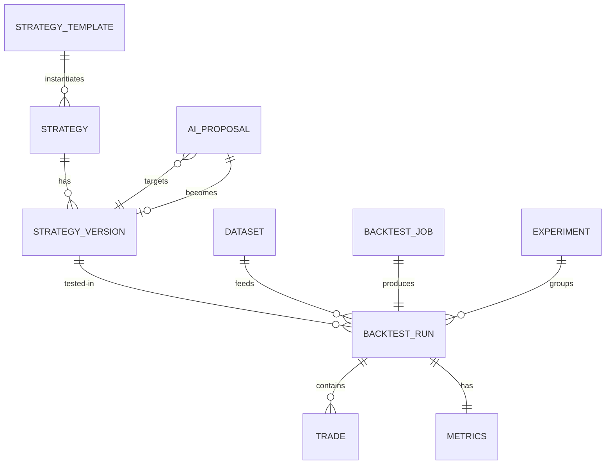

# Domain model

## Entities

### StrategyTemplate (immutable, versioned blueprint)
- `templateId` (e.g. `trend-pullback`), `templateVersion` (semver), `displayName`, `description`
- `paramSchema` (JSON Schema / zod): each param has type, range, default, unit
- `buildDefault(params) → StrategySpec` — deterministic constructor
- Templates are immutable; changing defaults or schema = new `templateVersion`.

MVP templates (4): `trend-pullback`, `breakout-donchian`, `mean-reversion-bollinger`, `momentum-rsi`. Full definitions in `docs/templates.md`.

### Strategy (mutable shell) → StrategyVersion (immutable snapshot)
- `Strategy`: `id, name, templateRef? {templateId, templateVersion} | null, currentVersionId, createdAt, updatedAt`
- `StrategyVersion`: `id, strategyId, versionNumber (1,2,3…), spec (canonical JSON), specHash (sha256), parentVersionId?, provenance {actor: user|ai-assistant, patchSummary?, aiTraceId?}, createdAt`
- Rule: any edit (UI or AI patch) creates a new `StrategyVersion`. Completed backtests reference `strategyVersionId`, never a mutable pointer.

### StrategySpec (the strategy — data, never code)
Full schema in `docs/strategy-spec.md`. Summary:
```text
StrategySpec {
  specVersion: "1.0",
  universe: { symbol, timeframe },
  indicators: IndicatorDef[],
  entry: { direction: long|short|both, logic: all|any, conditions: Condition[] },
  exits: { stopLoss, takeProfit, trailing?, timeStop?, oppositeSignal?: bool },
  filters: { session?, volatility?, spreadMax? },
  risk: { riskPerTradePct, maxNotionalMult, leverageMax, minStopDistanceAtr? },
  execution: { fillBasis: next_open, costsRef },   // costs live in BacktestConfig, not spec
  reservedForFuture: { partials?, pyramiding?, limitOrders? } // must be absent/empty in v1
}
```

### Dataset (immutable)
- `id, symbol, timeframe, barsHash, barCount, startTime, endTime, source {kind: csv|synthetic|sample, filename?, seed?}, manifest {gaps, duplicatesDropped, rowsRejected}, provenance, createdAt`
- Bars themselves stored in `dataset_bars` (or FlatFile + hash — see `docs/persistence.md` decision: SQLite table for MVP ≤ ~2M bars, indexed by `(datasetId, openTime)`).

### BacktestConfig (per-run assumptions — part of run identity)
```text
{ startTime, endTime, initialCapital, costs { spreadBps, commissionPerUnit, slippageBps },
  inSample {from,to}? , outOfSample {from,to}? (labeling only in MVP — engine ignores except run labels),
  instrumentMetaVersion (e.g. "instruments/1.0" — lot steps/pip sizes versioned, part of hash),
  engineVersion }
```
`engineVersion` (e.g. `engine/1.0`) covers execution semantics AND metric definitions; result hash covers it so engine upgrades never silently rewrite history. There is deliberately **no** `riskOverride` (risk lives in the spec; overrides would fork identity semantics) and **no** engine `seed` (the engine is seed-free deterministic; seeds exist only on the synthetic-data generator where randomness belongs).

### Instrument metadata (versioned, part of run identity — previously missing domain)
- `InstrumentMeta { symbol, pipSize, contractSize, lotStep, minQty, priceDecimals, metaVersion }`. Sizing math depends on it, so it is hashed into every run (`instrumentMetaVersion`). Changing a lot step = new meta version; old runs keep theirs.
- MVP values (`instruments/1.0`): FX lotStep 1000 / min 1000; XAUUSD lotStep 1 oz / min 1; BTCUSD lotStep 0.001 / min 0.001.

### Order (explicit lifecycle — previously under-modeled)
- `Order { id, runId, signalBar, fillBar?, kind: market(v1), direction, qty?, state: pending|filled|skipped_capital|skipped_min_qty|ignored_pyramid|expired_end_of_data, fillPrice?, fees? }`. Every signal bar with a pending decision leaves exactly one terminal order row — "why so few trades?" is answered by order states, not absence.

### BacktestJob (mutable lifecycle) → BacktestRun (immutable result)
- `BacktestJob`: `id, state: queued|running|completed|failed|cancelled, cancel_requested: bool, progress {barsProcessed, barTotal}, createdAt, startedAt?, finishedAt?, error?`
- `BacktestRun`: `id, jobId, strategyVersionId, datasetId, config (canonical), specHash, datasetHash, configHash, resultHash, trades[], orders[], equityCurve (downsampled), fullResolutionHash, metrics{}, assumptionsText[], warnings[] (gaps, min-stop clamps), createdAt`
- `resultHash = sha256(specHash + datasetHash + configHash + engineVersion + canonicalTrades)`.

### Experiment (comparison group)
- `id, name, runIds[], hypothesis?, baselineRunId?, createdAt`. No statistics are stored on the experiment; comparison is always computed from the referenced immutable runs (diff view: what changed in spec/config/dataset + metric deltas).

### AI artifacts (quarantined, never authoritative)
- `AiProposal`: `id, inputRefs {strategyVersionId?, runIds[]}, intent (raw text), patch (StrategyPatch), validation {ok, errors[]}, status: proposed|confirmed|rejected, createdAt`
- `StrategyPatch`: list of ops (`setParam | addCondition | removeCondition | addGroup | addFilter | removeFilter | setRisk | setExits`, max 10 ops, applied atomically in order to `baseSpecHash` — any op failing validation rejects the whole patch) with allowlisted JSON-pointer targets — never raw spec replacement from AI in MVP (prevents whole-spec hallucination). `addCondition` takes an optional `parentGroupId` (default: top level).

## State machines

```text
BacktestJob: queued → running → completed | failed | cancelled
  (cancel allowed from queued|running; retry creates NEW job+run, never mutates)

StrategyVersion: created → (referenced by runs) → superseded (logical, via currentVersionId pointer; row never updated)

AiProposal: proposed → confirmed (→ new StrategyVersion) | rejected (terminal)
```

## Relationships


